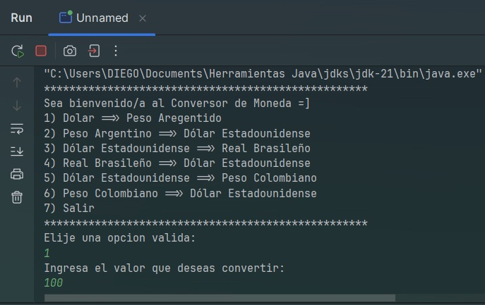
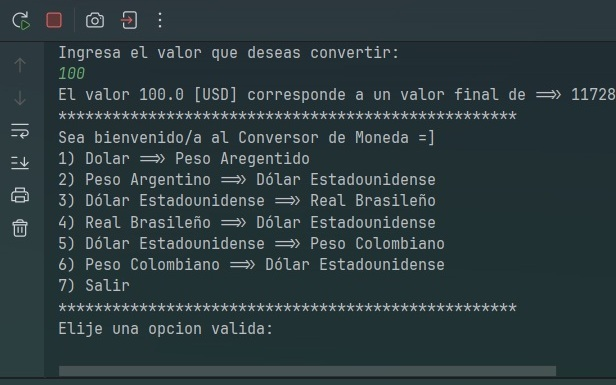
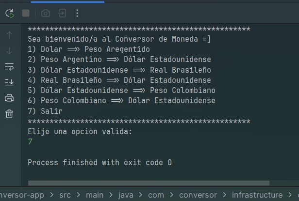

# Conversor de Monedas
_Desafío diseñado para evaluar habilidades de resolución de problemas, basado en el curso "Java Orientado a Objetos G8 - ONE"._

## Construido con 🛠️
* [OpenJDK-21](https://jdk.java.net/java-se-ri/21) - Kit de desarrollo Java version 21
* [IntelliJ](https://www.jetbrains.com/idea/) - Editor de codigo para Java

# Como ejecutar el proyecto
Abre el proyecto con Intellij y dale a "Run" y empezar a jugar 😊.

# Capturas del proyecto

Paso 1  

Paso 2  

Paso 3  

## Versionado 📌
Usamos [Git](https://git-scm.com/) para el versionado de codigo y [Github](https://github.com/) como repositorio remoto

## Autores ✒️
* **Diego D. Mamani Ramos** - *Aprendiendo* - [mi perfil github](https://github.com/Noonexyz1)

## Expresiones de Gratitud 🎁
* Este es un proyecto de challenge 📢
* Gracias a Oracle One y Alura por la oportunidad de darme este curso 🤓.

---
⌨️ con ❤️ por [Diego D.](https://github.com/Noonexyz1) 😊